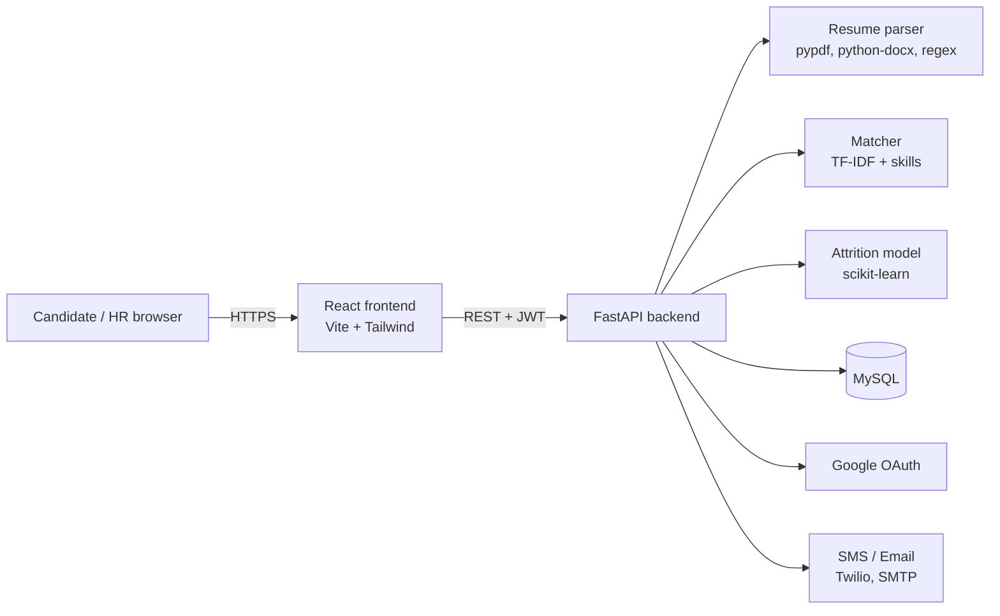

<div align="center">

# TalentLens

**AI-powered recruitment and employee retention platform**

Screens resumes, ranks candidates against each job, books interviews without clashes, and predicts which employees might leave, with the reasons why.

[**Live demo**](https://talentlens-bdns.onrender.com) · [HR portal](https://talentlens-bdns.onrender.com/hr/login) · [Candidate sign-in](https://talentlens-bdns.onrender.com/login)


</div>

---

## Try it

The live demo comes with sample jobs, candidates, interviews and employees. All demo accounts use the password **`Demo@1234`**.

| Role | Sign in at | Use |
|---|---|---|
| HR manager | [/hr/login](https://talentlens-bdns.onrender.com/hr/login) | HR ID **`HR-DEMO-0001`** |
| HR interviewer | [/hr/login](https://talentlens-bdns.onrender.com/hr/login) | HR ID **`HR-DEMO-0002`** |
| Candidate | [/login](https://talentlens-bdns.onrender.com/login) | **`candidate@talentlens.app`** |

> The demo runs on a free server. If it has been idle, the first page can take up to a minute to load.

---

## The problem

Recruiters spend most of their screening time reading resumes that don't fit the role, and companies usually find out an employee was unhappy only when the resignation letter arrives. TalentLens tackles both: it puts the best-fit applicants at the top of the list, and it flags employees who show early signs of leaving, so HR can act before it's too late.

## Features

### For candidates
- Sign up with **email, Google, or a mobile number** (one-time SMS code)
- Browse open roles and apply by uploading a resume (PDF, DOCX or TXT)
- Track every application through each stage, with interview date, time and link

### For the HR team
- **Separate HR portal.** Each HR member gets a personal **HR ID** (e.g. `HR-7K3P-9QXM`) at sign-up and signs in with HR ID + password. HR accounts can't use the candidate sign-in, and candidates can't open HR pages.
- **Ranked applicants.** Every resume is parsed and scored against the job the moment it's uploaded, with matched and missing skills shown.
- **Hiring pipeline.** Drag-and-drop board: Applied → Shortlisted → Interviewing → Offer → Hired / Not selected. Candidates are notified when they move.
- **Interview scheduler.** Suggests free slots for both the interviewer and the candidate, and refuses double bookings.
- **Retention (attrition prediction).** Risk of leaving for each employee, the main reasons behind it, and a live what-if form ("what if we give a 15% raise?").
- **Dashboard.** Open jobs, hiring funnel, applications per week, time-to-hire, average match, upcoming interviews and retention watch.
- **People & access** and an **activity log** of sign-ins and changes.

---

## How the AI works

### Resume matching
1. **Parsing.** Text is extracted from the resume, then regular expressions and a skill dictionary (110+ skills and about 200 common spellings) pull out name, email, phone, skills, years of experience, education and LinkedIn/GitHub links.
2. **Scoring.** Each application gets a match score from 0 to 100:

| Component | Weight | How it's measured |
|---|---|---|
| Skill coverage | 55% | Share of the job's required skills found in the resume |
| Text similarity | 30% | TF-IDF cosine similarity between resume and job description |
| Experience fit | 15% | Candidate's years compared with the job's minimum |

When HR edits a job, every existing applicant is re-scored automatically.

### Attrition prediction
- **Model:** logistic regression on standardised features, chosen because each prediction can be explained.
- **Features:** overtime, job satisfaction, work-life balance, environment satisfaction, years since last promotion, commute distance, salary, last salary hike, years at company, number of previous companies, and age.
- **Explanations:** each feature's contribution is calculated per employee, so HR sees *why* someone is at risk (e.g. "Regularly works overtime", "No promotion in 4 years").
- **Performance:** about 73% accuracy and ROC AUC 0.81 on held-out data.
- **Data:** trains on a synthetic dataset modelled on the IBM HR Analytics attrition dataset. Set `ATTRITION_CSV` to train on the real IBM file or a company's own history.

> The model estimates how *likely* someone is to leave, not *when*. It's meant to start a conversation (a stay interview, a raise, a role change), never to penalise anyone.

---

## Architecture



The React app is built into static files and served by the FastAPI server, so the whole product ships as **one Docker container** plus a database.

## Engineering subjects covered

| Module | Subjects |
|---|---|
| Resume parser and skill extraction | Natural language processing, regular expressions |
| Candidate matching | Machine learning, information retrieval (TF-IDF, cosine similarity) |
| Attrition prediction | Machine learning, statistics, model evaluation |
| Interview scheduler | Algorithms (interval overlap, greedy slot search) |
| Hiring pipeline, roles, data model | DBMS, software engineering, OOP |
| Authentication | Information security (bcrypt, JWT, OAuth 2.0 / OpenID Connect, OTP) |
| Email and SMS notifications | Computer networks (SMTP, REST APIs) |
| Build and deployment | DevOps (Docker, Jenkins CI/CD), cloud computing |

## Tech stack

| Layer | Tools |
|---|---|
| Frontend | React 18, React Router, Vite, Tailwind CSS, Recharts, Lucide icons |
| Backend | Python, FastAPI, SQLAlchemy, Pydantic |
| AI / ML | scikit-learn, NumPy, pypdf, python-docx |
| Database | MySQL (SQLite for local development) |
| Auth | bcrypt, PyJWT, Google OAuth 2.0, phone OTP |
| DevOps | Docker (multi-stage), Docker Compose, Jenkins, GitHub |
| Hosting | Render (app), Aiven (MySQL), UptimeRobot (uptime) |

---

## Run it locally

Needs **Python 3.11+** and **Node.js 20+**. No database to install: locally it uses a SQLite file automatically.

**Windows (one command)**
```powershell
.\run-local.ps1
```
If PowerShell blocks scripts, run `Set-ExecutionPolicy -Scope Process Bypass` first.

**macOS / Linux**
```bash
./run-local.sh
```

Then open http://localhost:8000.

<details>
<summary><b>Step by step (Windows Command Prompt)</b></summary>

```cmd
cd frontend
npm install
npm run build
cd ..
xcopy /e /i /y frontend\dist backend\static
cd backend
python -m venv .venv
.venv\Scripts\python -m pip install --only-binary=:all: -r requirements.txt
.venv\Scripts\python -m uvicorn app.main:app --port 8000
```
</details>

<details>
<summary><b>Full stack with Docker (app + MySQL)</b></summary>

```bash
cp .env.example .env
docker compose up --build
```
</details>

<details>
<summary><b>Frontend development with hot reload</b></summary>

Run the backend on port 8000 as above, then in another terminal:
```bash
cd frontend
npm install
npm run dev
```
Open http://localhost:5173. API calls are proxied to port 8000.
</details>

---

## Deploy (free)

1. **Database:** create a free MySQL service on [Aiven](https://aiven.io) and copy its **Service URI**.
2. **App:** on [Render](https://render.com), choose **New → Web Service**, pick this repo (it detects the Dockerfile), and select the **Free** instance.
3. **Environment variables:**
```
   DATABASE_URL=<Aiven Service URI, pasted as-is>
   JWT_SECRET=<long random text>
   PUBLIC_URL=https://<your-app>.onrender.com
   COMPANY_CODE=<code required to create HR accounts>
   SEED_DEMO=true
```
4. **Health check path:** `/api/health`
5. **Keep it awake:** add an [UptimeRobot](https://uptimerobot.com) monitor on `https://<your-app>.onrender.com/api/health` every 5 minutes, using the **GET** method.

Every push to `main` redeploys automatically.

<details>
<summary><b>Google sign-in setup</b></summary>

1. [Google Cloud Console](https://console.cloud.google.com) → create a project → **Google Auth Platform**.
2. **Branding:** app name, support email, home page, privacy policy (`/privacy`) and terms (`/terms`) links.
3. **Clients → Create client → Web application**, with the authorised redirect URI `https://<your-app>.onrender.com/api/auth/oauth/google/callback`.
4. **Audience → Publish app.**
5. Add `GOOGLE_CLIENT_ID` and `GOOGLE_CLIENT_SECRET` to the environment.
</details>

<details>
<summary><b>Phone sign-in and email</b></summary>

- **Phone (SMS codes):** works out of the box in demo mode, where the code is shown on screen. For real SMS, add `TWILIO_ACCOUNT_SID`, `TWILIO_AUTH_TOKEN` and `TWILIO_FROM`, then set `OTP_DEMO_MODE=false`.
- **Email:** add `SMTP_HOST`, `SMTP_PORT`, `SMTP_USER`, `SMTP_PASSWORD` and `SMTP_FROM` (e.g. Gmail with an App Password). Without them, emails are written to the server log.
</details>

### Environment variables

| Variable | Required | Purpose |
|---|---|---|
| `DATABASE_URL` | Yes (production) | MySQL connection string. Encrypted connections are used automatically when it contains `ssl-mode=REQUIRED` |
| `JWT_SECRET` | Yes | Signs sign-in sessions |
| `PUBLIC_URL` | Yes | The app's public address, used for Google sign-in |
| `COMPANY_CODE` | Recommended | Code needed to create an HR account |
| `SEED_DEMO` | No | Loads demo data on first start (`true` / `false`) |
| `GOOGLE_CLIENT_ID`, `GOOGLE_CLIENT_SECRET` | No | Enables Google sign-in |
| `TWILIO_*`, `OTP_DEMO_MODE` | No | Real SMS codes for phone sign-in |
| `SMTP_*` | No | Email notifications |
| `APP_TIMEZONE` | No | Defaults to `Asia/Kolkata` |
| `ATTRITION_CSV` | No | Train the attrition model on a real dataset |

See [`.env.example`](.env.example) for the full list.

---

## Testing and CI/CD

```bash
cd backend
pip install -r requirements-dev.txt
python -m pytest -q
```

14 automated tests cover resume parsing, scoring, sign-up and sign-in (email, phone OTP and the HR portal), access control between HR and candidates, the full hiring flow, interview clash detection and attrition prediction.

The **Jenkinsfile** runs the pipeline: backend tests (JUnit report) → frontend build → Docker image build → start the container → health check.

## Security

- Passwords hashed with **bcrypt**. Phone codes stored only as **HMAC hashes**, expire in 10 minutes, and are rate-limited.
- **JWT** sessions with role-based access: every HR endpoint rejects candidate tokens.
- HR accounts are created only through the HR portal, and can be locked behind a company code.
- Encrypted database connection in production, and a non-root user inside the Docker container.
- An activity log records sign-ins and changes.

## Project structure

```
talentlens/
├── backend/
│   ├── app/
│   │   ├── main.py            # FastAPI app; serves the built frontend
│   │   ├── models.py          # Database tables
│   │   ├── security.py        # Passwords, JWT, role checks, audit log
│   │   ├── routers/           # auth, oauth, phone, jobs, interviews, employees, admin
│   │   └── services/          # resume_parser, matcher, attrition, skills, mailer, sms
│   └── tests/                 # pytest suite
├── frontend/
│   └── src/
│       ├── pages/             # Candidate pages, HR portal, HR pages, privacy/terms
│       ├── components/        # Layout, score ring, modals, sign-in buttons
│       └── lib/               # API client, auth, formatting
├── Dockerfile                 # Multi-stage build: Node → Python
├── docker-compose.yml         # App + MySQL for local use
├── Jenkinsfile                # CI/CD pipeline
└── run-local.ps1 / .sh        # One-command local start
```

Interactive API documentation is available at `/docs` on any running instance.

## Limitations and future scope

- **Single company:** one deployment serves one company's careers page and HR team. A multi-company (multi-tenant) version would add a companies table and scope all data by company.
- **Attrition timing:** the model predicts likelihood, not timing. Survival analysis (e.g. a Cox model) could estimate *when*.
- **Training data:** the demo model uses synthetic data; real use needs the company's own history.
- **Resume parsing:** scanned image-only PDFs aren't supported; OCR could be added.
- **Fairness:** add bias checks on match scores and predictions across groups before real-world use.

## Author

**Vismaya Katkar**, B.E. Computer Engineering
GitHub: [@katkarvismaya19-web](https://github.com/katkarvismaya19-web)
